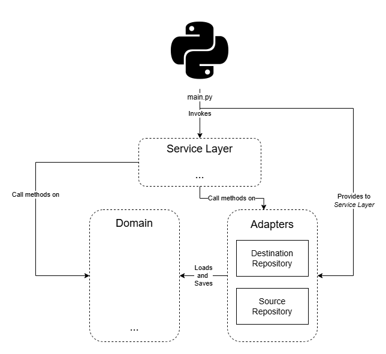
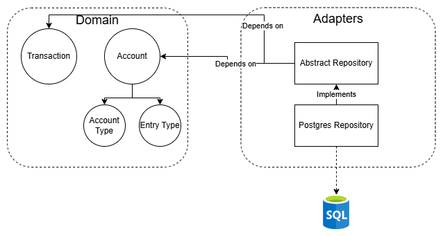

# Accounting-ingest-webapp

This repository is a web-based personal accounting application built with Python and Flask that allows the user to securely log in and ingest financial transactions. At its core, it implements a double-entry bookkeeping system where the user can record transactions by specifying a debit account, a credit account, an amount, and a description. The backend uses a Clean Architecture approach with a Repository pattern to interact with a PostgreSQL database, ensuring that business logic is kept independent of infrastructure. Furthermore, the repository is highly structured for continuous integration and deployment, featuring a comprehensive pytest suite for automated testing, a Dockerized development environment, and GitHub Actions pipelines that handle both testing and Terraform-based infrastructure deployment to Google Cloud Platform.

The Terraform configuration automates the deployment of the Accounting Ingest Web App infrastructure on Google Cloud Platform, consisting of a serverless compute layer and a managed relational database. It provisions a Google Cloud Run service configured with Identity-Aware Proxy (IAP) to securely expose the containerized application, securely retrieving sensitive environment variables directly from Google Secret Manager. For the database layer, it deploys a Google Cloud SQL instance running PostgreSQL 18 featuring automated backups, point-in-time recovery, and private networking configurations. The Cloud Run service connects to this database seamlessly via a Cloud SQL volume mount, and IAM policies are configured to restrict application access exclusively to authorized users.

## Features

- **Development Environment**: Pre-configured development container for consistent setup.
- **Comprehensive Testing**: Includes pre-configured unit tests and integration tests to ensure code reliability, along with test coverage reporting.
- **Pipeline Integration**: Automated pipelines to unit test python solution.
- **Clean Architecture**: Designed using Onion/Clean Architecture principles and the Repository pattern to decouple business logic from infrastructure.
- **Infrastructure as Code (IaC)**: Automated infrastructure deployment to Google Cloud Platform (GCP) managed via Terraform.

## Development environment

Recommended development enviroment is VSCode Dev Containers extension. The configuration and set up of this dev container is already defined in `.devcontainer/devcontainer.json` so setting up a new containerised dev environment on your machine is straight-forward.

Pre-requisites:
- docker installed on your machine and available on your `PATH`
- [Visual Studio Code](https://code.visualstudio.com/) (VSCode) installed on your machine
- [Dev Containers](https://marketplace.visualstudio.com/items?itemName=ms-vscode-remote.remote-containers) vscode extension installed

Steps:
- In VSCode go to `View -> Command Pallet` and search for the command `>Dev Containers: Rebuild and Reopen in Container`

The first time you open the workspace within the container it'll take a few minutes to build the container, setup the virtual env and then login to gcloud. At the end of this process you will be presented with a url and asked to provide an authorization. Simply follow the url, permit the access and copy the auth code provided at the end back into to the terminal and press enter. 

### Configure Git 

For seamless Git usage in a Dev Container, create a local script at `.devcontainer/git_config.sh` (do not push this file to the repository) and set your GitHub account name and email:

```bash
#!/bin/bash

git config --global user.name "your github account name"
git config --global user.email "your github account email"
```

## Database Setup

To run the application locally, you will need to create and configure a development database. Detailed instructions on how to build the database solution, create the necessary tables using the provided scaffolding script, and set up user permissions can be found in the `database/README.md` file.

It is also highly recommended to create a separate database specifically for testing purposes. This ensures that your automated test suite does not interfere with or overwrite your development data.

### Unit tests

To execute tests, provide a `tests/.env` file with the following data:

```ini
USERNAME={web username}
PASSWORD={web password}
HASHED_PASSWORD={PASSWORD hashed with werkzeug.security.generate_password_hash}
SECRET_KEY={web page secret key}
HOST={postgresql server IP Address}
DATABASE_NAME={testing database name}
USER_NAME={database user name}
USER_PASSWORD={database user password}
ISTESTING=true
```

To run the tests, execute the following command in terminal:

```bash
python -m pytest -vv --cov --cov-report=html
```

Unit testing has been integrated into the CI/CD pipeline. A merge will not be approved unless all tests pass successfully. Additionally, a coverage report is automatically generated and provided as a comment for reference. A Service Account granted with role `roles/cloudsql.client` is required. Current workflow, `.github/workflows/pytest.yaml`, is set to access GCP Project through Workload Identity Provider.

#### Flask App

To run the Flask app locally for debugging and testing purposes, you need to load the following Flask Environment Variables in your terminal:

```bash
export FLASK_APP=src/entrypoints/flaskapp/app.py:server
export FLASK_ENV=development
export FLASK_DEBUG=1
```

Then, to start the server:

```bash
flask run
```

When run in this mode, the server will automatically restart whenever a file is saved, allowing for seamless testing and development.
To fully integrate the authetication process, you also need to provide a .env file with the following variables:

```ini
USERNAME={web username}
PASSWORD={web password}
HASHED_PASSWORD={PASSWORD hashed with werkzeug.security.generate_password_hash}
SECRET_KEY={web page secret key}
HOST={postgresql server IP Address}
DATABASE_NAME={development database name}
USER_NAME={database user name}
USER_PASSWORD={database user password}
ISTESTING=true
```

In order to create a hashed password you must use:

```python
from werkzeug.security import generate_password_hash
print(generate_password_hash("yourpassword"))
```

## Component Diagram

The code architecture of the Python solution is illustrated below. We adopt Onion/Clean Architecture, so ensuring that our Business Logic (Domain Model) has no dependencies. Our goal is to follow SOLID principles, promoting seamless future changes and enhancing code clarity.

The `src/entrypoints/flaskapp/app.py` file is used by the deployed solution as entrypoint. Nonetheless, several entry points could be provided seamlessly because, following Clean Architecture principles, the `main.py` function is treated as the last detail. This ensures that none of the core solution code depends on the entry point; instead, the entry point depends on the core solution code. This design promotes flexibility and allows for the easy addition of new entry points without impacting the existing architecture. Which, in turn, means that the source is independent of the infrastructure. 

The Python entrypoint invokes one of the services found in `src/services.py`. These services receives objects of the clients for the repositories as parameters.

The services handle the execution by calling methods found in the Domain and Adapters to ensure the successful completion of the process.

<p align="center">
    
</p>

The client for data storage have been implemented following the Repository pattern. This design pattern abstracts the logic for retrieving and storing data, providing a higher-level interface to the rest of the application. By doing so, it enables the implementation of the Dependency Inversion Principle (DIP). This approach allows our Database Layer (Adapters) to depend on the Domain Model, rather than the other way around. This, in turn, facilitates the seamless use of the same Business Logic/Domain Model in another scenario with a different Infrastructure/Data Layer. Related code can be found on `src/repository.py`.

<p align="center">
    
</p>

In the picture above you can also find the Domain Model diagram representing the code found in `src/model` folder. Circles are value objects and rectangles are entities.


## CI/CD - Pipeline Integration
There are 2 CI/CD pipelines implemented as GitHub Actions:

1. **Pytest**: This pipeline is defined in the `.github/workflows/pytest.yaml` file. It is triggered on every pull request, what runs unit tests using `pytest`. It also generates a test coverage report to ensure code quality. If any test fails, the pipeline will block the merge process, ensuring that only reliable code is integrated into the main branch. Finally, the pipeline requiress a pytest coverage over a given threshold. A Service Account granted with role `roles/cloudsql.client` is required. Current workflow, `.github/workflows/pytest.yaml`, is set to access GCP Project through Workload Identity Provider.

2. **Deployment**: The deployment process is managed through two GitHub Actions workflows. The first workflow, `.github/workflows/terraform-validate.yaml`, validates the Terraform code and generates a deployment plan during a pull request, blocking merge in case of failures. The second workflow, `.github/workflows/terraform-apply.yaml`, executes after a merge to deploy the changes to Google Cloud Platform (GCP).

## Deployment implementation

The Terraform code in this repository automates the deployment of the accounting-ingest-webapp as a Cloud Run Service. It provisions and configures the necessary resources to ensure seamless ingestion and processing of data.

The Terraform code automates the deployment process by managing the following components:

- **Google Cloud Run (v2)**: Hosts the containerized Flask application with Identity-Aware Proxy (IAP) enabled for secure, authenticated access.
- **Google Cloud SQL**: A managed PostgreSQL 18 instance (`db-f1-micro`) configured with automated backups, deletion protection, and authorized networks.
- **Google Secret Manager Integration**: Securely injects secrets (e.g., database credentials, app secret keys) into Cloud Run as environment variables.
- **Cloud IAM**: Manages Identity-Aware Proxy (IAP) invoker and accessor roles, restricting access to authorized users (e.g., `roles/iap.httpsResourceAccessor`).

### Prerequisites for Terraform Execution

Before the Terraform code can be executed, ensure the following:

1. **Cloud Function Service Account**:
    - Provide a Service Account for the Cloud Run Service with the following roles:
      - roles/secretmanager.secretAccessor
      - roles/cloudsql.client

2. **Terraform Execution Permissions**:
    - Either your user account or the Service Account used to run the Terraform code must have the following roles:
      - roles/cloudsql.admin
      - roles/artifactregistry.writer
      - roles/storage.admin

To reuse the GitHub Action, follow these steps:

1. **Create a Workload Identity Provider (WIP):**  
   This enables keyless authentication for GitHub Actions.
   - [Learn why this is needed](https://cloud.google.com/blog/products/identity-security/enabling-keyless-authentication-from-github-actions).  
   - [Follow these instructions](https://docs.github.com/en/actions/security-for-github-actions/security-hardening-your-deployments/configuring-openid-connect-in-google-cloud-platform).

2. **Set up Service Account:**
   - Grant the Terraform Executor Service Account the necessary permissions to execute Terraform code as indicated before.
   - Assign the role `roles/iam.workloadIdentityUser`.
   - Set the Service Account as the principal for the Workload Identity Provider created in step 1.

3. **Provide secrets:**
    - `WORKLOAD_IDENTITY_PROVIDER` & `SERVICE_ACCOUNT_EMAIL` must be provided as Github Actions Secrets.


### Considerations

The Terraform code is designed to be executed by the workflows defined in `.github/workflows/terraform-validate.yaml` and `.github/workflows/terraform-apply.yaml`. 

The backend for this solution is configured to reside in Google Cloud Storage (GCS). If you plan to reuse this code, ensure you update the backend bucket name accordingly.

If you want to execute the solution locally, follow these steps:

1. Outside the dev container, build the Docker image:
```bash
docker build -t LOCATION-docker.pkg.dev/PROJECT_ID/REPOSITORY_NAME/IMAGE_NAME:TAG .
```

2. Push the Docker image to Artifact Registry:
```bash
docker push LOCATION-docker.pkg.dev/PROJECT_ID/REPOSITORY_NAME/IMAGE_NAME:TAG
```

3. Optionally, add additional tags to the image:
```bash
docker tag LOCATION-docker.pkg.dev/PROJECT_ID/REPOSITORY_NAME/IMAGE_NAME:TAG LOCATION-docker.pkg.dev/PROJECT_ID/REPOSITORY_NAME/IMAGE_NAME:NEW_TAG
docker push LOCATION-docker.pkg.dev/PROJECT_ID/REPOSITORY_NAME/IMAGE_NAME:NEW_TAG
```
