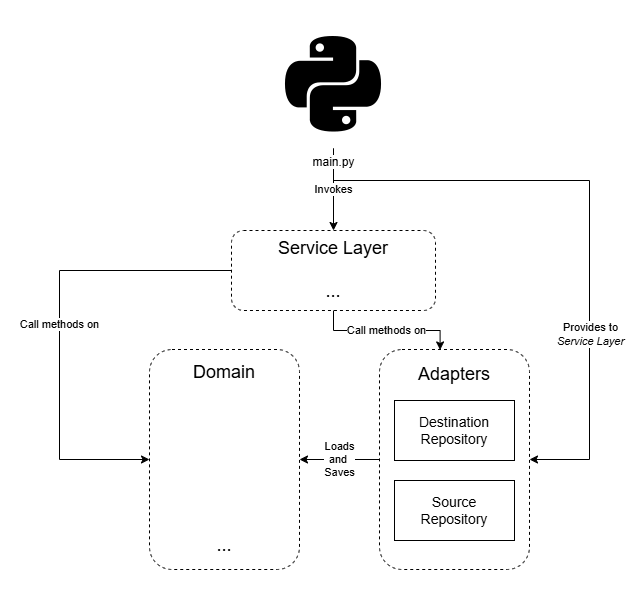
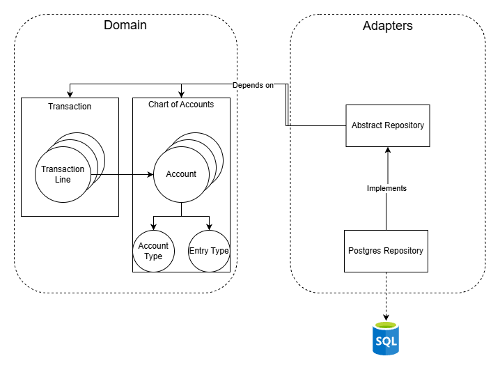

# Accounting-ingest-webapp

This repository is a personal double-entry bookkeeping accounting application built with Python and Flask. It provides three complementary interfaces: an interactive **Web Application**, a **RESTful API**, and a **Command Line Interface (CLI)** designed for comprehensive ledger management.

- **Web Application**: Enables users to securely authenticate, manage hierarchical charts of accounts (categorized by type, physical status, and archive state), record financial transactions via dynamic dependent form dropdowns, explore ledger records with date range filtering, and interactively delete transactions.
- **RESTful API**: Exposes versioned endpoints (`/api/v1/...`) powered by Flask-Smorest and Flask-JWT-Extended. Currently, its capabilities include:
  - **JWT Authentication (`POST /api/v1/auth/login`)**: Secure credential authentication and issuance of Bearer JWT access tokens.
  - **Transaction Ingestion (`POST /api/v1/transactions`)**: Programmatic recording of double-entry transactions with strict Marshmallow schema validation (validating positive amounts, valid integer account identifiers, and ISO dates) and automatic mapping to immutable domain DTOs, returning the assigned `transaction_id` upon creation.
  - **Self-Documenting Interactive API Docs**: Complete OpenAPI 3.0 specification and interactive Swagger UI documentation hosted at `/docs`.
- **Command Line Interface (CLI)**: Enables fast, scriptable transaction ingestion directly from the terminal using Click. Ingests JSON files matching the API schema via `create-transaction -fp /path/to/transaction.json`.

The backend uses a **Clean / Onion Architecture** and **Domain-Driven Design (DDD)** approach combined with the **Repository pattern** and dedicated **Data Transfer Objects (DTOs)**, ensuring complete decoupling between presentation (Flask/WTForms), domain business rules (Aggregate Roots and Entities), and PostgreSQL persistence infrastructure. Furthermore, the repository is highly structured for continuous integration and deployment, featuring strict static typing, a comprehensive pytest suite for automated testing with Gherkin-style documentation, a Dockerized development container, and GitHub Actions pipelines that handle both testing and Terraform-based infrastructure deployment to Google Cloud Platform.

The Terraform configuration automates the deployment of the Accounting Ingest applications infrastructure on Google Cloud Platform, consisting of a serverless compute layer and a managed relational database. It provisions Google Cloud Run services for both the Web Application and the Web API, each configured with Identity-Aware Proxy (IAP) to securely expose the containerized applications while retrieving sensitive environment variables directly from Google Secret Manager. For the database layer, it deploys a Google Cloud SQL instance running PostgreSQL 18 featuring automated backups, point-in-time recovery, and private networking configurations. The Cloud Run services connect to this database seamlessly via Cloud SQL volume mounts, and IAM policies are configured to restrict application access exclusively to authorized users.

## Features

### Web Application Features

- **User Authentication & Session Security**: Protected login and logout flows securing application endpoints with session management.
- **Double-Entry Bookkeeping**: Enforces balanced debit and credit entries across asset, liability, equity, revenue, and expense accounts.
- **Chart of Accounts Management**: Allows creating and structuring parent and child accounts categorized by type, physical status, and archive state.
- **Dynamic Dependent Form Dropdowns**: Real-time client-side dropdown filtering for postable and parent accounts based on selected account types without requiring page reloads.
- **Transaction Exploration & Date Range Filtering**: View and filter ledger records by customizable date ranges (`start_date`, `end_date`).
- **Interactive Transaction Deletion**: Select individual transaction rows directly within the web table to safely delete transactions and their associated ledger entries.
- **Visual Feedback & Notification Toasts**: Real-time Bootstrap toasts and flash alerts communicating domain validation errors (`ValueError`), success notices (including created transaction identifiers), and system messages.

### RESTful API Features

- **Resource-Oriented Design**: Clean, versioned REST endpoints (`/api/v1/...`) following standard HTTP methods and status codes (`201 Created`, `400 Bad Request`, `401 Unauthorized`, `422 Unprocessable Entity`, `500 Internal Server Error`).
- **JWT Bearer Token Authentication**: Protected endpoints secured via `Flask-JWT-Extended` with token issuance at `POST /api/v1/auth/login`.
- **Transaction Management**: Ingest double-entry ledger transactions via `POST /api/v1/transactions`, returning the generated `transaction_id` and confirmation message on `201 Created` responses.
- **Marshmallow Schema Validation & DTO Mapping**: Strict request payload schema validation mapped directly to domain DTOs via `.to_dto()`.
- **Interactive OpenAPI / Swagger Documentation**: Auto-generated interactive Swagger UI documentation and OpenAPI 3.0 spec accessible at `/docs`.

### Command Line Interface (CLI) Features

- **File-Based Transaction Ingestion**: Ingest double-entry ledger transactions directly from JSON files using `create-transaction -fp <path>`.
- **Consistent Schema Validation**: Validates JSON payloads against required fields (`date`, `amount`, `debit_account_id`, `credit_account_id`), ensuring data integrity and returning the assigned `transaction_id`.
- **Scriptable & Automation-Ready**: Designed for automation workflows, shell scripts, and batch processing without requiring a web browser.

### System & Architecture Features

- **Clean / Onion Architecture & DDD**: Pure Python zero-dependency domain core (`src/model.py`), aggregate roots (`ChartOfAccounts`, `Transaction`), and repository interfaces (`AbstractRepository`) adhering to the Dependency Inversion Principle.
- **Strict Domain Invariants Enforcement**: Enforces business rules at the domain level, including balanced debit/credit sums, single-level parent-child account nesting, and case-insensitive unique account naming.
- **Decoupled Boundaries via DTOs**: Presentation, forms, and services communicate exclusively through immutable Data Transfer Objects (`src/dto.py`).
- **Multi-Entrypoint Extensibility**: Clean decoupling allows extending entrypoints (such as CLI tools in `src/entrypoints/cli`) without modifying core domain logic.
- **PostgreSQL Infrastructure Adapter**: Centralized, safely parameterized SQL queries (`src/utils/sql_queries.py`) with dynamic table abstractions (`SqlTable`).
- **Automated Database Scaffolding & Permissions**: SQL scaffolding (`database/build_scaffolding.psql`) with environment-based permission configuration (*dev*, *test*, *prod*).
- **Comprehensive Automated Testing**: Pytest test suite with Gherkin-style documentation, isolated fixtures, parametrization, and code coverage enforcement.
- **Development Container**: Pre-configured VS Code Dev Containers (`.devcontainer/`) for reproducible local development.
- **CI/CD Automation**: GitHub Actions workflows for continuous integration (testing and coverage verification) and Terraform validation.
- **Infrastructure as Code (IaC)**: Automated GCP infrastructure deployment (Cloud Run, Cloud SQL PostgreSQL 18, Identity-Aware Proxy, Secret Manager) managed via Terraform.

## Development environment

Recommended development environment is VSCode Dev Containers extension. The configuration and set up of this dev container is already defined in `.devcontainer/devcontainer.json` so setting up a new containerised dev environment on your machine is straight-forward.

Pre-requisites:
- docker installed on your machine and available on your `PATH`
- [Visual Studio Code](https://code.visualstudio.com/) (VSCode) installed on your machine
- [Dev Containers](https://marketplace.visualstudio.com/items?itemName=ms-vscode-remote.remote-containers) vscode extension installed

Steps:
- In VSCode go to `View -> Command Palette` and search for the command `>Dev Containers: Rebuild and Reopen in Container`

The first time you open the workspace within the container it'll take a few minutes to build the container, setup the virtual env and then login to gcloud. At the end of this process you will be presented with a url and asked to provide an authorization. Simply follow the url, permit the access and copy the auth code provided at the end back into to the terminal and press enter. 

### Configure Git 

For seamless Git usage in a Dev Container, create a local script at `.devcontainer/git_config.sh` (do not push this file to the repository) and set your GitHub account name and email:

```bash
#!/bin/bash

git config --global user.name "your github account name"
git config --global user.email "your github account email"
```

### Configure MCP Tokens

To configure MCP server tokens (such as Context7) without committing sensitive credentials to version control, create a local script at `.devcontainer/load_mcp_config_tokens.sh` (this file is ignored by Git):

```bash
#!/bin/bash

export MCP_CONTEXT7_TOKEN="your_context7_token_here"
```


## Database Setup

To run the application locally, you will need to create and configure a development database. Detailed instructions on how to build the database solution, create the necessary tables using the provided scaffolding script, and set up user permissions can be found in the `database/README.md` file.

It is also highly recommended to create a separate database specifically for testing purposes. This ensures that your automated test suite does not interfere with or overwrite your development data.

### Unit tests

To execute tests, provide a `tests/.env` file with the following data:

```ini
USERNAME={web username}
PASSWORD={web password}
HASHED_PASSWORD={PASSWORD hashed with werkzeug.security.generate_password_hash}
SECRET_KEY={web page secret key}
HOST={postgresql server IP Address}
DATABASE_NAME={testing database name}
USER_NAME={database user name}
USER_PASSWORD={database user password}
ISTESTING=true
```

To run the tests, execute the following command in terminal:

```bash
python -m pytest -vv --cov --cov-report=html
```

Unit testing has been integrated into the CI/CD pipeline. A merge will not be approved unless all tests pass successfully. Additionally, a coverage report is automatically generated and provided as a comment for reference. A Service Account granted with role `roles/cloudsql.client` is required. Current workflow, `.github/workflows/pytest.yaml`, is set to access GCP Project through Workload Identity Provider.

#### Web App

To run the Web app locally for debugging and testing purposes, you need to load the following Flask Environment Variables in your terminal:

```bash
export FLASK_APP=src/entrypoints/webapp/app.py:server
export FLASK_ENV=development
export FLASK_DEBUG=1
export FLASK_RUN_PORT=5000
```

Then, to start the server:

```bash
flask run
```

When run in this mode, the server will automatically restart whenever a file is saved, allowing for seamless testing and development.
To fully integrate the authentication process, you also need to provide a `.env` file with the following variables:

```ini
USERNAME={web username}
PASSWORD={web password}
HASHED_PASSWORD={PASSWORD hashed with werkzeug.security.generate_password_hash}
HOST={postgresql server IP Address}
DATABASE_NAME={development database name}
USER_NAME={database user name}
USER_PASSWORD={database user password}
ISTESTING=true
```

In order to create a hashed password you must use:

```python
from werkzeug.security import generate_password_hash
print(generate_password_hash("yourpassword"))
```

#### RESTful API

To run the RESTful API locally for debugging and testing purposes, load the following Flask Environment Variables in your terminal:

```bash
export FLASK_APP=src/entrypoints/webapi/app.py:server
export FLASK_ENV=development
export FLASK_DEBUG=1
export FLASK_RUN_PORT=5001
```

Then, to start the API server:

```bash
flask run
```

When run in this mode, the server will automatically restart whenever a file is saved, allowing for seamless testing and development.
To fully integrate the authentication process, you also need to provide a `.env` file with the following variables:

```ini
USERNAME={web username}
PASSWORD={web password}
HASHED_PASSWORD={PASSWORD hashed with werkzeug.security.generate_password_hash}
HOST={postgresql server IP Address}
DATABASE_NAME={development database name}
USER_NAME={database user name}
USER_PASSWORD={database user password}
ISTESTING=true
```

In order to create a hashed password you must use:

```python
from werkzeug.security import generate_password_hash
print(generate_password_hash("yourpassword"))
```

##### API Documentation & Swagger UI
Once running, the interactive Swagger UI and OpenAPI documentation is available at:
- **Swagger UI**: `http://localhost:5001/docs`
- **OpenAPI JSON Spec**: `http://localhost:5001/openapi.json`

##### API Endpoints Overview

| Method | Endpoint | Description | Auth | Response Codes |
|---|---|---|---|---|
| `POST` | `/api/v1/auth/login` | Authenticate user credentials and receive JWT access token | None | `200 OK`, `401 Unauthorized`, `422 Unprocessable Entity` |
| `POST` | `/api/v1/transactions` | Create and record a new double-entry transaction | Bearer JWT | `201 Created`, `400 Bad Request`, `401 Unauthorized`, `422 Unprocessable Entity`, `500 Internal Server Error` |

**Example: Ingesting a Transaction**

- **Request** (`POST /api/v1/transactions`):
  ```json
  {
    "date": "2024-06-15",
    "amount": "250.50",
    "debit_account_id": 2,
    "credit_account_id": 4,
    "description": "Office supplies"
  }
  ```

- **Response** (`201 Created`):
  ```json
  {
    "transaction_id": 12,
    "message": "Transaction recorded successfully"
  }
  ```

#### CLI Tool

The repository provides a Command Line Interface (CLI) powered by Click for programmatic transaction recording via JSON files.

To execute a transaction creation command:

```bash
python -m src.entrypoints.cli create-transaction -fp /path/to/transaction.json
```

The JSON file uses the same schema format as the REST API:

```json
{
  "date": "2024-06-15",
  "amount": "250.50",
  "debit_account_id": 2,
  "credit_account_id": 4,
  "description": "Office supplies"
}
```

Upon successful creation, the CLI outputs:
```
Transaction recorded successfully! Transaction ID: <id>
```


## Component Diagram

The code architecture of the Python solution is illustrated below. We adopt Onion/Clean Architecture, ensuring that our Business Logic (Domain Model) has no external dependencies. Our goal is to follow SOLID principles, promoting seamless future changes and enhancing code clarity.

The repository provides multiple presentation entrypoints—the web application in [`src/entrypoints/webapp/app.py`](file:///workspaces/accounting-ingest-webapp/src/entrypoints/webapp/app.py), the RESTful API in [`src/entrypoints/webapi/app.py`](file:///workspaces/accounting-ingest-webapp/src/entrypoints/webapi/app.py), and the CLI tool in [`src/entrypoints/cli/__main__.py`](file:///workspaces/accounting-ingest-webapp/src/entrypoints/cli/__main__.py). Following Clean Architecture principles, entrypoints are treated as delivery mechanisms and ultimate details. This ensures that none of the core business logic depends on presentation frameworks; instead, entrypoints depend on the core application services. This design promotes flexibility and allows adding or evolving entrypoints without modifying domain logic or database infrastructure.

The Python entrypoints invoke application services in [`src/services.py`](file:///workspaces/accounting-ingest-webapp/src/services.py) using specialized **Data Transfer Objects (DTOs)** defined in [`src/dto.py`](file:///workspaces/accounting-ingest-webapp/src/dto.py). The services coordinate execution between the Domain Model ([`src/model.py`](file:///workspaces/accounting-ingest-webapp/src/model.py), structured around DDD Aggregate Roots such as `ChartOfAccounts` and `Transaction`) and the Repositories ([`src/repository.py`](file:///workspaces/accounting-ingest-webapp/src/repository.py)) to ensure data integrity and persistence.

<p align="center">
    
</p>

The clients for data storage have been implemented following the Repository pattern aligned with DDD guidelines (one repository contract per Aggregate Root). This data access pattern abstracts the logic for retrieving and storing data, providing a higher-level interface to the rest of the application. By doing so, it enables the implementation of the Dependency Inversion Principle (DIP). This approach allows our Database Layer (Adapters) to depend on the Domain Model, rather than the other way around. This, in turn, facilitates the seamless use of the same Business Logic/Domain Model in another scenario with a different Infrastructure/Data Layer. Related code can be found in `src/repository.py`.

<p align="center">
    
</p>

In the picture above you can also find the Domain Model diagram representing the code found in `src/model.py`.


## CI/CD - Pipeline Integration
There are 2 CI/CD pipelines implemented as GitHub Actions:

1. **Pytest**: This pipeline is defined in the `.github/workflows/pytest.yaml` file. It is triggered on every pull request, running unit and integration tests using `pytest`. It also generates a test coverage report to ensure code quality. If any test fails, the pipeline will block the merge process, ensuring that only reliable code is integrated into the main branch. Finally, the pipeline requires a pytest coverage over a given threshold. A Service Account granted with role `roles/cloudsql.client` is required. Current workflow, `.github/workflows/pytest.yaml`, is set to access GCP Project through Workload Identity Provider.

2. **Deployment**: The deployment process is managed through two GitHub Actions workflows. The first workflow, `.github/workflows/terraform-validate.yaml`, validates the Terraform code during a pull request, blocking merge in case of failures. The second workflow, `.github/workflows/terraform-apply.yaml`, executes after a merge to deploy the changes to Google Cloud Platform (GCP).

## Deployment implementation

The Terraform code in this repository automates the deployment of the Accounting Ingest applications as Google Cloud Run services (`accounting-ingest-webapp` and `accounting-ingest-webapi`). It provisions and configures the necessary resources to ensure seamless ingestion and processing of data.

The Terraform code automates the deployment process by managing the following components:

- **Google Cloud Run (v2)**: Hosts the containerized applications:
  - **Web Application (`accounting-ingest-webapp`)**: Containerized Flask web app with Identity-Aware Proxy (IAP) enabled.
  - **Web API (`accounting-ingest-webapi`)**: Containerized Flask-Smorest REST API with Identity-Aware Proxy (IAP) enabled.
- **Google Cloud SQL**: A managed PostgreSQL 18 instance (`db-f1-micro`) shared by both services, configured with automated backups, deletion protection, and authorized networks.
- **Google Secret Manager Integration**: Securely injects secrets (e.g., database credentials, app secret keys) into both Cloud Run services as environment variables.
- **Cloud IAM**: Manages Identity-Aware Proxy (IAP) invoker and accessor roles for both services, restricting access to authorized users (e.g., `roles/iap.httpsResourceAccessor`).

### Prerequisites for Terraform Execution

Before the Terraform code can be executed, ensure the following:

1. **Cloud Run Service Account**:
    - Provide a Service Account for the Cloud Run Service with the following roles:
      - roles/secretmanager.secretAccessor
      - roles/cloudsql.client

2. **Terraform Execution Permissions**:
    - Either your user account or the Service Account used to run the Terraform code must have the following roles:
      - roles/cloudsql.admin
      - roles/artifactregistry.writer
      - roles/storage.admin
      - roles/iap.admin

To reuse the GitHub Action, follow these steps:

1. **Create a Workload Identity Provider (WIP):**  
   This enables keyless authentication for GitHub Actions.
   - [Learn why this is needed](https://cloud.google.com/blog/products/identity-security/enabling-keyless-authentication-from-github-actions).  
   - [Follow these instructions](https://docs.github.com/en/actions/security-for-github-actions/security-hardening-your-deployments/configuring-openid-connect-in-google-cloud-platform).

2. **Set up Service Account:**
   - Grant the Terraform Executor Service Account the necessary permissions to execute Terraform code as indicated before.
   - Assign the role `roles/iam.workloadIdentityUser`.
   - Set the Service Account as the principal for the Workload Identity Provider created in step 1.

3. **Provide secrets:**
   - `WORKLOAD_IDENTITY_PROVIDER` & `SERVICE_ACCOUNT_EMAIL` must be provided as Github Actions Secrets.


### Considerations

The Terraform code is designed to be executed by the workflows defined in `.github/workflows/terraform-validate.yaml` and `.github/workflows/terraform-apply.yaml`. 

The backend for this solution is configured to reside in Google Cloud Storage (GCS). If you plan to reuse this code, ensure you update the backend bucket name accordingly.

If you want to execute the solution locally, follow these steps:

1. Outside the dev container, build the Docker image:
```bash
docker build --target DOCKERFILE_TARGET -t LOCATION-docker.pkg.dev/PROJECT_ID/REPOSITORY_NAME/IMAGE_NAME:TAG .
```

2. Push the Docker image to Artifact Registry:
```bash
docker push LOCATION-docker.pkg.dev/PROJECT_ID/REPOSITORY_NAME/IMAGE_NAME:TAG
```

3. Optionally, add additional tags to the image:
```bash
docker tag LOCATION-docker.pkg.dev/PROJECT_ID/REPOSITORY_NAME/IMAGE_NAME:TAG LOCATION-docker.pkg.dev/PROJECT_ID/REPOSITORY_NAME/IMAGE_NAME:NEW_TAG
docker push LOCATION-docker.pkg.dev/PROJECT_ID/REPOSITORY_NAME/IMAGE_NAME:NEW_TAG
```
